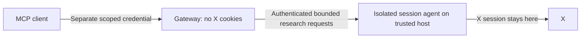

# Credential boundaries and deployment risk

This implementation is for one trusted owner. It is not a multi-user credential
broker or a hardened cloud cookie vault. A public source repository does not
imply a public shared service. No automatic cookie synchronization or Cloudflare
Worker deployment is implemented.

## Current boundaries

| Credential / data | Where it is used | What compromise permits |
|---|---|---|
| X `auth_token` and `ct0` | Owner session file; copied into twscrape `account.db`; session provider memory | Reuse of the X session subject to X's controls; authority is not limited to this server's read tools |
| `MCP_ACCESS_TOKEN` | MCP client and personal HTTP server; reverse proxy can see it when terminating TLS | Access to exposed research tools and known saved results; request/quota abuse; no supported cookie-export endpoint |
| Public results and queries | Local `research.db`, client context, selected provider | Research history disclosure; queries can be sensitive despite public source posts |

X cookies are never used as MCP bearer tokens or sent to FxTwitter. Anonymous
FxTwitter requests disclose query text and lookup references to that provider.
The server returns normalized public data, not cookies, raw HTTP headers or a
general-purpose authenticated request interface.

Read-only tool registration and public-content checks constrain the normal API
path. They cannot constrain someone who obtains the raw X session or arbitrary
code execution in the credential-holding process. Successful tests of the tool
contract do not establish resistance to a compromised dependency or host.

`session.json` and `account.db` are not application-encrypted. Filesystem access
controls and a non-root Docker user reduce exposure to other ordinary users;
they do not stop the owner process, the host administrator or a leaked backup.
Encrypting only the JSON file would leave the database copy exposed. Read-only
mounts protect file integrity, not confidentiality. Deleting a local cookie file
does not revoke an already stolen session; revoke that session through X too.

## Current HTTP protections and limits

All HTTP listeners require a random independent bearer token of at least 32
characters. This includes loopback because a tunnel or reverse proxy can expose
it remotely. An unauthenticated caller receives only the minimal health response.
Host/Origin validation is additional protection, not a substitute for auth.
Use TLS outside the host and keep authorization/query bodies out of proxy logs.

The bearer is currently static and has no built-in expiry, per-client scope,
per-client quota, or individual revocation list. Rotate it and restart the server
to invalidate it. Provider pacing is not per-client abuse control. Results are
not separated by tenant. Do not share this token with untrusted users.

## Recommended deployments

For local use, prefer stdio: the X session stays on the same trusted machine.
For personal remote use, prefer one dedicated host/account and authenticated
private-network access where the MCP client supports it. A home server is not
automatically safer than a managed cloud server; patching, administrator access,
backups and who can deploy code determine which host is actually trusted.

If a cloud entry point is needed, a stronger future design is:

**The split agent is a proposed hardening step, not present in v0.1.** It should
use a separate OS identity/container and independently enforce public read
operations, allowed upstream hosts, request limits and response projections.
No arbitrary URL, HTTP headers, script execution or credential export should be
accepted from the gateway. Compromising the gateway would still expose research
traffic and permit allowed requests; isolation reduces access to the raw cookie.
Compromising the agent/host can still expose the session.

Before expanding beyond a trusted personal host, prioritize the split process,
an OS/managed secret store, isolation of the account DB from ordinary data backups,
short-lived/revocable client credentials and per-client quotas. An ephemeral
account DB could reduce persisted copies but must preserve cooldown behavior
and must not become a rate-limit reset mechanism. These are unimplemented work.

Cloudflare Workers Secrets can keep secrets out of source/plain configuration,
but Worker code can read its bound secret at runtime. A malicious deployment
or compromised runtime can therefore use/exfiltrate it. This is not solved by
calling a cookie a "secret" or encrypting it with a key available to that process.
Avoid distributing a primary account's cookie across multiple worker deployments.
A separate research account can reduce unrelated personal data exposure; it
does not make the session a read-scoped credential.

## References

- [OWASP Cookie Theft Mitigation](https://cheatsheetseries.owasp.org/cheatsheets/Cookie_Theft_Mitigation_Cheat_Sheet.html): valid session theft can bypass the need to log in again.
- [Cloudflare Workers Secrets](https://developers.cloudflare.com/workers/configuration/secrets/): secrets are accessible to the bound Worker code at runtime.
- [MCP security best practices](https://modelcontextprotocol.io/docs/2025-11-25/tutorials/security/security_best_practices): separate credential audiences; do not use an upstream token as the MCP server's authorization credential.
